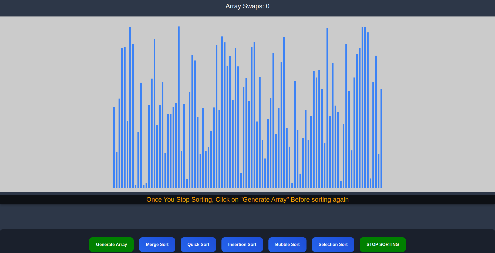

# Sorting Algorithm Visualizer

Welcome to the Sorting Algorithm Visualizer! This project is a web application built with React that allows users to visualize various sorting algorithms. It provides an interactive and educational way to understand how different sorting algorithms work.

## Features

- Visualize various sorting algorithms including Merge Sort, Quick Sort,Bubble Sort, Selection Sort, Insertion Sort.
- Step-by-step visualization to observe the inner workings of each algorithm.

## Interface



## Getting Started

### Prerequisites

To run this project locally, you need to have the following software installed:

- [Node.js](https://nodejs.org/) (version 14 or higher)
- [npm](https://www.npmjs.com/) (version 6 or higher) or [yarn](https://yarnpkg.com/) (version 1.22 or higher)

### Installation

1. Clone the repository:
   ```bash
   git clone https://github.com/Sreeharij/sorting-visualizer
   cd sorting-visualizer
2. Install the dependencies:
   ```bash
   npm install
   # or
   yarn install
### Running the Application

3. To start the development server, run:
   ```bash
   npm start
   # or
   yarn start  


This will launch the app in development mode. Open http://localhost:3000 to view it in the browser.


## License

This project is licensed under the terms of the MIT License. See the [LICENSE](./LICENSE) file for more information.

## Acknowledgments

- Inspired by [Clément Mihailescu's Sorting Visualizer](https://github.com/clementmihailescu/Sorting-Visualizer)

